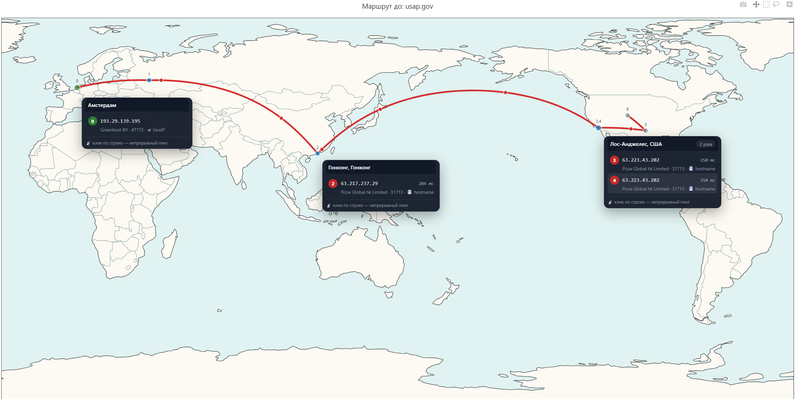

# GeoTrace MAP

Desktop tool for visualizing network routes on a world map with multi-source node geolocation.



## Features

- **Traceroute** (`tracert`/`traceroute`) with hop parsing, RTT (average and minimum), and private address filtering.
- **Multi-source geolocation** with evidence priority: `📇 hostname (PTR)` → `🧠 trained` → `⚡IXP (PeeringDB)` → `📜 RIPEstat` → `📍 route neighbor` → `🛰 GeoIP`.
- **Anycast/CDN detection** (Cloudflare, Akamai, Fastly, CloudFront, Google, Azure…) with honest labeling "you're on the nearest edge node".
- **Physics audit**: comparing geography against latency using calibrated signal propagation speed in fiber (~100 km/ms adjusted ×1.4 for non-linearity of real routes); impossible hops are marked ⚠, incorrectly trained records are demoted.
- **Learning** (off / semi-auto / auto) with safeguards: promotion after 2+ observations on different days, TTL, conflict resolution, atomic writes, anycast is not learned.
- **Interactive map** (Plotly): clustering of nearby nodes, custom tooltips, directional "packets" on composer (low CPU), idle pause.
- **Continuous ping** of any map node (draggable panels), **TCP-ping fallback** when ICMP is blocked, median RTT.
- **Export**: CSV, JSON, standalone HTML, text report to clipboard.
- **i18n** (RU/EN), dark/light themes, target history, layout-independent hotkeys.

## Installation

Requires **Python 3.8+**

### pip packages
| Package | Installation | Purpose |
|---------|--------------|---------|
| `requests` | `pip install requests` | HTTP requests to GeoIP and RIPEstat WHOIS |

`urllib3` is installed automatically as a dependency of `requests`.
Everything else (`tkinter`, `subprocess`, `json`, `socket`, `http.server`, etc.) is Python standard library — no installation needed.

### tkinter (GUI)
- **Windows / macOS**: included in the official Python installer.
- **Linux**: usually installed separately:
  - Debian/Ubuntu: `sudo apt install python3-tk`
  - Fedora: `sudo dnf install python3-tkinter`
  - Arch: `sudo pacman -S tk`

### System utilities
- **Windows**: `tracert` and `ping` are built-in; `curl` is available in Windows 10+ (only needed for TCP fallback — if missing, the program simply skips this step).
- **Linux**: `sudo apt install traceroute iputils-ping curl` (`ping` is usually already installed).

### Quick check
```bash
python -c "import tkinter, requests; print('OK')"
```

- Windows: `tracert` is built-in; `curl` is usually present (only needed for TCP-ping fallback).
- Linux: install `traceroute` (`sudo apt install traceroute`).

## Launch

```bash
python geotrace.py
```

The map opens in your default browser and updates in real time.

## Files (created in home directory)

| File | Purpose |
|------|---------|
| `desktop_trace_map.html` | map page |
| `desktop_trace_data.js` | live route data |
| `geotrace_settings.json` | theme, language, learning mode, history |
| `geotrace_learned.json` | local database of trained cities |

## Accuracy and limitations

GeoIP databases determine city by *registration* of the pool, not by physics, so they are systematically inaccurate for transit routers and anycast ("Moscow pools", "San Francisco for Cloudflare"). GeoTrace compensates with hostname codes, WHOIS, neighbor heuristics, latency audits, and learning. Nevertheless, geolocation remains an estimate, not truth.

## Vibe-coding presence
100%

## License

MIT — see [LICENSE](LICENSE).
